# /goal — Plan → Execute → Test → Repeat → Report

Autonomous goal pursuit: **full detailed plan with milestones first**, complete **one milestone at a time**, **test after each**, then **full system test**, then a **charted final report**.

## Non-negotiable rules

1. **NEVER skip Phase 0 (plan).** No code edits until the user sees the full plan (unless they already approved an identical plan in this chat).
2. **NEVER start milestone N+1 until milestone N is DONE and TESTED.**
3. **NEVER claim a milestone is done without running its tests and showing real output.**
4. **NEVER claim the goal is complete without Phase 3 (full system test).**
5. **NEVER give a vague summary.** Use the Final Report Template exactly.
6. If a milestone test fails → **fix before continuing**. Do not skip forward.
7. If blocked (missing creds, env, hardware, permission) → record in **Blockers**, attempt workarounds once, then continue other milestones if possible.
8. **Do not commit or push** unless the user explicitly asked.

---

## Phase 0 — Full detailed plan (MANDATORY)

Before any implementation, output this plan. User invoked `/goal` = approval to execute unless they said **"plan only"**.

### Plan template (fill every section)

```markdown
# /goal Plan — [short title]

## Goal
[One sentence: what "done" looks like]

## Scope
- **In scope:** ...
- **Out of scope:** ...

## Assumptions & risks
| # | Assumption / risk | Mitigation |
|---|-------------------|------------|
| 1 | ... | ... |

## Milestones
| ID | Milestone | Files / areas | Deliverable | Tests to run after | Done when |
|----|-----------|---------------|-------------|-------------------|-----------|
| M1 | ... | ... | ... | ... | ... |
| M2 | ... | ... | ... | ... | ... |

## Full system test (Phase 3)
| Command | Purpose | Pass criteria |
|---------|---------|---------------|
| ... | ... | ... |

## Estimated order
M1 → M2 → ... → Phase 3
```

**Milestone rules:**
- Each milestone must be **independently testable**.
- Prefer **3–8 milestones**; split large work.
- Each milestone "Tests to run" must be **concrete commands** (not "make sure it works").

### Jarvis-One default test commands (use when relevant)

| Layer | Command | Cwd |
|-------|---------|-----|
| TypeScript | `npm run typecheck` | `app/` |
| Unit tests | `npm run test` | `app/` |
| Vite build | `npm run build` | `app/` |
| Rust check | `cargo check` | `app/src-tauri/` |
| Rust tests | `cargo test` | `app/src-tauri/` |
| Manifest script | `node ../scripts/build-updater-manifest.test.mjs` | `app/` |

Pick only what applies to touched areas.

---

## Phase 1 — Execute milestones (ONE AT A TIME)

For **each milestone Mi** in order:

### Step 1.1 — Announce
```markdown
## ▶ Milestone Mi — [name]
**Status:** IN PROGRESS
```

### Step 1.2 — Implement
- Complete **all** work for Mi only.
- Do not bleed into Mi+1.

### Step 1.3 — Milestone test gate (MANDATORY)
Run **every** test listed for Mi in the plan. Use the terminal; capture **real output**.

```markdown
### Mi test results
| Test | Command | Result | Notes |
|------|---------|--------|-------|
| ... | `...` | ✅ PASS / ❌ FAIL | ... |
```

**If any test fails:** fix → re-run → repeat until pass or blocked.

### Step 1.4 — Milestone close
```markdown
### Mi complete
- **Changed:** [files + one-line each]
- **Tests:** all pass / blocked (see Blockers)
```

Only then proceed to Mi+1.

---

## Phase 2 — Progress tracking (update every milestone)

```markdown
## Progress
- [x] M1 — [name] — tested ✅
- [x] M2 — [name] — tested ✅
- [ ] M3 — [name]
```

---

## Phase 3 — Full system test (MANDATORY after ALL milestones)

Run **every** command from the plan's "Full system test" table. Show full output (truncate only if >80 lines; then show head + tail + "N lines omitted").

If anything fails → fix → re-run full system test suite.

---

## Phase 4 — Final report (MANDATORY)

Use this structure **exactly**. Include **mermaid charts**.

```markdown
# /goal — Final Report

## At a glance
| Metric | Value |
|--------|-------|
| Milestones planned | N |
| Milestones completed | N |
| Milestones blocked | N |
| Full system test | ✅ PASS / ❌ FAIL / ⚠️ PARTIAL |
| Files changed | N |

## Progress chart


## Timeline

```mermaid
gantt
    title Goal execution
    dateFormat HH:mm
    section Milestones
    M1 Name           :done, m1, 00:00, 30m
    M2 Name           :done, m2, after m1, 45m
```


## What was done
| Milestone | What changed | Key files |
|-----------|--------------|-----------|
| M1 | ... | ... |

## Blockers (could NOT do)
| Item | Why blocked | Workaround tried | User action needed |
|------|-------------|------------------|-------------------|
| ... | ... | ... | ... |

(If none: `None — all planned work completed.`)

## Test output summary
| Phase | Command | Exit | Summary |
|-------|---------|------|---------|
| M1 | `...` | 0 | ... |
| System | `npm run typecheck` | 0 | ... |

### Detailed test log (system test)
\`\`\`
[paste actual terminal output]
\`\`\`

## Executive summary
[3–5 sentences: goal, what shipped, confidence level, what to do next]

## Suggested follow-ups
1. ...
```

---

## Invocation

```
/goal [describe what you want accomplished]
```

**First action:** Phase 0 plan → then Phase 1 unless user said "plan only".

---

## Anti-patterns (FORBIDDEN)

- ❌ Implementing before publishing the milestone table
- ❌ "I'll test later" / skipping per-milestone tests
- ❌ Marking done without command output
- ❌ One giant diff across unrelated milestones
- ❌ Final summary without mermaid charts and blockers table
