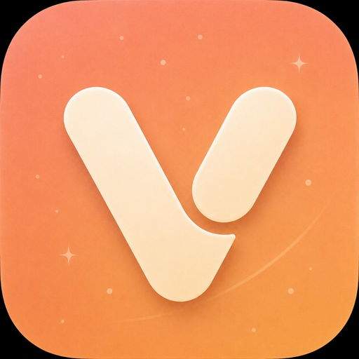
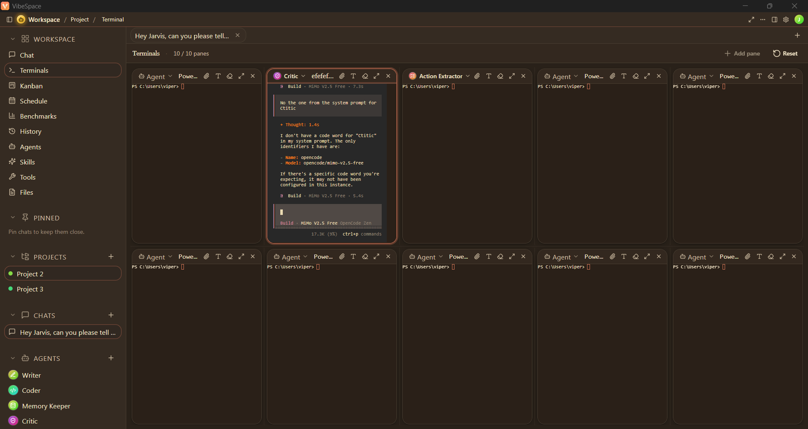
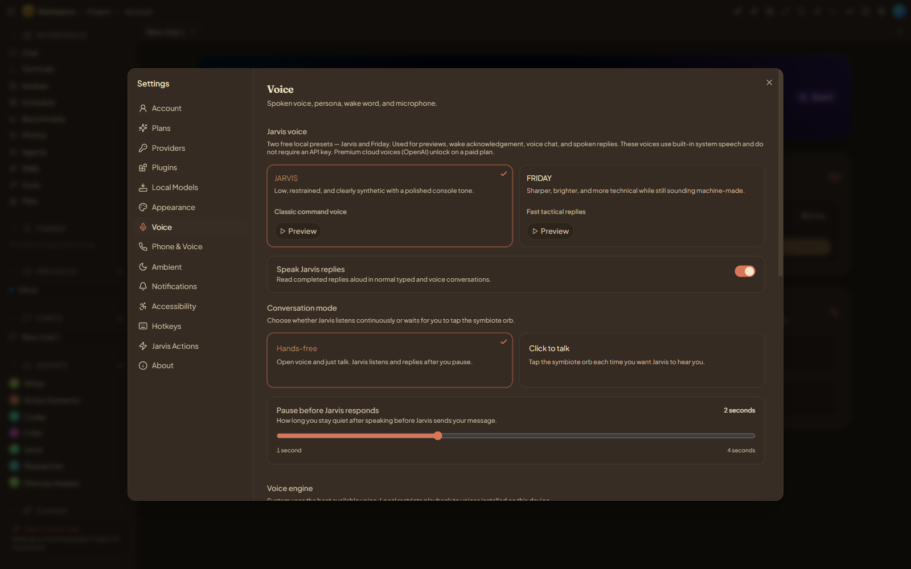
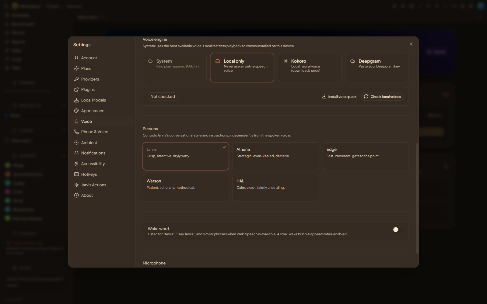
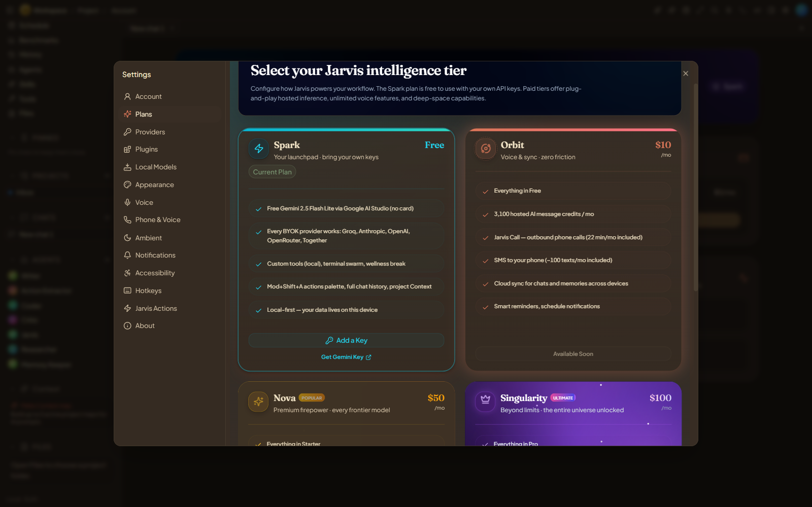

<p align="center">
  
</p>

<h1 align="center">VibeSpace</h1>

<p align="center">
  The AI workspace where every model, agent, voice, and task lives under one roof.
</p>

<p align="center">
  <a href="https://github.com/Cookie774-GameDev/VibeSpace/releases/latest"></a>
  <a href="LICENSE"></a>
  
</p>

<p align="center">
  <a href="https://vibespaceos.com/">Website</a> ·
  <a href="#install">Install</a> ·
  <a href="#screenshots">Screenshots</a> ·
  <a href="#features">Features</a> ·
  <a href="https://github.com/Cookie774-GameDev/VibeSpace/releases/latest">Download</a>
</p>

---

## Install

One line in PowerShell:

```powershell
irm https://raw.githubusercontent.com/Cookie774-GameDev/VibeSpace/main/install/install.ps1 | iex
```

Or grab the [latest release](https://github.com/Cookie774-GameDev/VibeSpace/releases/latest) directly — both the `.exe` installer and `.msi` package are available. See [DOWNLOAD.md](DOWNLOAD.md) for manual downloads and checksums.

Requires Windows 10 1809 or later, 64-bit.

## Screenshots

### Terminals

A tile grid of real PTY shells. Run an agent CLI in one pane while shells stay live in the rest — every session persists across navigation.



### Voice

Two built-in presets — Jarvis and Friday — with selectable personas and your choice of engine.





### Plans

Free forever with your own keys. Paid tiers add hosted inference, cloud voice, and AI calling.



## Features

### Terminal workspace

- **Tile grid** — up to ten live PTY panes per project, drag-resizable, with per-project layouts.
- **Persistence** — sessions survive page switches and pane rearranging; shells keep running in the background.
- **Per-terminal fullscreen** — focus one pane edge to edge, then Esc back to the grid. Other shells stay alive.
- **Font scaling** — cycle each pane's font size independently, plus a global default in settings.
- **Hold-to-clear** — clear a terminal's screen with a deliberate press-and-hold, so a stray click never wipes your scrollback.
- **Agent CLIs** — run opencode, Claude Code, Codex, or any terminal agent inside a pane, side by side with plain shells.

### Voice

- **Jarvis & Friday presets** — two free local voices for replies, previews, and wake acknowledgement. No API key needed.
- **Local Kokoro engine** — a neural voice that downloads once and runs entirely on your machine.
- **Personas** — pick the conversational style (Jarvis, Athena, Edge, Watson, HAL) independently of the spoken voice.
- **Hands-free or click-to-talk** — continuous listening with a configurable pause, or push-to-talk.

### Subscriptions

- **Free (Spark)** — bring your own API keys, local voice, terminals, and the full workspace. Local-first; your data stays on your device.
- **Paid tiers** — hosted AI credits, cloud voice, and Jarvis Call: real outbound phone calls and SMS from your workspace.
- **Launch promo** — early users get free Deepgram cloud voice minutes.

## Development

```bash
git clone https://github.com/Cookie774-GameDev/VibeSpace.git
cd VibeSpace
npm install
npm run tauri:dev
```

See [SETUP.md](SETUP.md) for prerequisites and [CHANGELOG.md](CHANGELOG.md) for version history.

## Links

- Website: [vibespaceos.com](https://vibespaceos.com/)
- Releases: [github.com/Cookie774-GameDev/VibeSpace/releases](https://github.com/Cookie774-GameDev/VibeSpace/releases)
- Issues: [github.com/Cookie774-GameDev/VibeSpace/issues](https://github.com/Cookie774-GameDev/VibeSpace/issues)

## License

[Apache 2.0](LICENSE)
