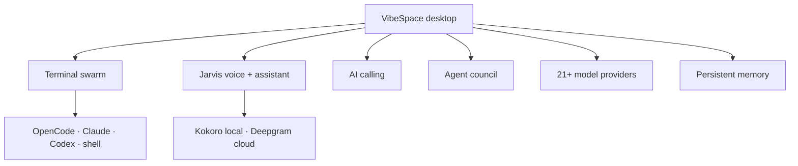

<div align="center">


# VibeSpace

**The AI workspace where every model, agent, voice, and task lives under one roof.**

<br/>

[](https://git.io/typing-svg)

<br/>

[](https://github.com/Cookie774-GameDev/VibeSpace/releases/latest)
[](LICENSE)
[](https://github.com/Cookie774-GameDev/VibeSpace/releases/latest)
[](https://vibespaceos.com/)

<br/>

[Website](https://vibespaceos.com/) · [Live demo](https://cookie774-gamedev.github.io/VibeSpace/) · [Install](#install) · [Features](#features) · [Download](https://github.com/Cookie774-GameDev/VibeSpace/releases/latest)

<br/>

<table>
<tr>
<td align="center" width="25%"><strong>🖥️ Terminals</strong><br/>Live PTY grid · agent CLIs</td>
<td align="center" width="25%"><strong>🎙️ Jarvis voice</strong><br/>Local Kokoro · hands-free</td>
<td align="center" width="25%"><strong>📞 AI calling</strong><br/>Phone + in-app WebRTC</td>
<td align="center" width="25%"><strong>🧠 One memory</strong><br/>Models · agents · tasks</td>
</tr>
</table>

> **VibeSpace** is the desktop app. **Jarvis** is the built-in voice assistant, calling layer, and command bar *inside* it — not the product name.

</div>

---

## Install

<table>
<tr>
<th>Windows</th>
<th>macOS / Linux</th>
</tr>
<tr>
<td>

```powershell
irm https://raw.githubusercontent.com/Cookie774-GameDev/VibeSpace/main/install/install.ps1 | iex
```

</td>
<td>

```bash
curl -fsSL https://raw.githubusercontent.com/Cookie774-GameDev/VibeSpace/main/install/install.sh | bash
```

</td>
</tr>
</table>

Or grab the [latest release](https://github.com/Cookie774-GameDev/VibeSpace/releases/latest) — `.exe`, `.msi`, `.dmg`, `.deb`, `.rpm`, and AppImage. See [DOWNLOAD.md](DOWNLOAD.md) for checksums.

**Requires** Windows 10 1809+, macOS 12+, or a modern Linux desktop (64-bit).

---

## What you get



| Surface | What it does |
|--------|----------------|
| **Terminal grid** | Up to 10 live PTY panes per project — OpenCode, Claude Code, Codex, or plain shells side by side |
| **Jarvis voice** | Built-in assistant voice (Jarvis & Friday presets), local Kokoro, hands-free or push-to-talk |
| **AI calling** | Call your assistant from the app or a real phone number — tasks, summaries, outbound alerts |
| **Agent council** | Route work across Coder, Researcher, Critic, and custom agents with shared context |
| **Model layer** | BYOK for Anthropic, OpenAI, Gemini, Groq, Ollama, and more — offline when you need it |

---

## Screenshots

### Terminals

A tile grid of real PTY shells. Run an agent CLI in one pane while shells stay live in the rest — every session persists across navigation.


### Voice

Two built-in presets — **Jarvis** and **Friday** — with selectable personas and your choice of engine.


### Plans

Free forever with your own keys. **Unlimited local Kokoro voice on every plan.** Paid tiers add hosted inference, AI phone minutes, in-app cloud voice, and Jarvis Call.

| Tier | Price | AI phone min/mo | In-app cloud voice (max) |
|------|-------|-----------------|--------------------------|
| Spark (Free) | $0 | — | unlimited local Kokoro |
| Orbit (Starter) | $10 | 22 | up to ~140+ min |
| Nova (Pro) | $50 | 109 | up to ~720+ min |
| Singularity (Ultra) | $100 | 217 | up to ~1,400+ min |
| Supernova (Apex) | $200 | 434 | up to ~2,890+ min |


---

## Features

### Terminal workspace

- **Tile grid** — up to ten live PTY panes per project, drag-resizable, with per-project layouts
- **Persistence** — sessions survive page switches; shells keep running in the background
- **Per-terminal fullscreen** — focus one pane edge to edge, then Esc back to the grid
- **Agent CLIs** — run OpenCode, Claude Code, Codex, or any terminal agent inside a pane
- **Agent briefings** — per-pane agent prompts land in `AGENTS.md`, not your input line

### Jarvis (built-in assistant)

- **Voice presets** — Jarvis & Friday for replies, previews, and wake acknowledgement
- **Local Kokoro** — neural voice that downloads once and runs on your machine
- **Command bar** — `Mod+J` assistant with app control, actions, and multi-step workflows
- **Hands-free or click-to-talk** — continuous listening or push-to-talk

### Subscriptions

- **Spark (free)** — bring your own keys, unlimited local Kokoro, full workspace
- **Paid tiers** — hosted AI credits plus shared call/voice buckets for phone + in-app cloud voice
- **Launch promo** — eligible accounts get one-time Deepgram credit (see plan pages)

---

## Development

```bash
git clone https://github.com/Cookie774-GameDev/VibeSpace.git
cd VibeSpace
npm install
npm run tauri:dev
```

See [SETUP.md](SETUP.md) for prerequisites and [CHANGELOG.md](CHANGELOG.md) for version history.

---

## Links

| | |
|---|---|
| **Website** | [vibespaceos.com](https://vibespaceos.com/) |
| **GitHub Pages demo** | [cookie774-gamedev.github.io/VibeSpace](https://cookie774-gamedev.github.io/VibeSpace/) |
| **Releases** | [github.com/Cookie774-GameDev/VibeSpace/releases](https://github.com/Cookie774-GameDev/VibeSpace/releases) |
| **Issues** | [github.com/Cookie774-GameDev/VibeSpace/issues](https://github.com/Cookie774-GameDev/VibeSpace/issues) |

---

<div align="center">

**VibeSpace** — built for vibe coders, by a vibe coder.

Apache 2.0 · [License](LICENSE)

</div>
