<div align="center">

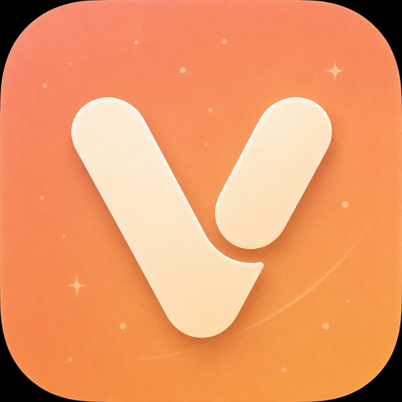

# VibeSpace

### One desktop workspace for AI, agents, coding, memory, voice, tasks, and tools.

**Chat with the model you want. Give work to agents. Let Jarvis coordinate it. Keep the context.**

<br/>

[](https://git.io/typing-svg)

<br/>

[](https://github.com/Cookie774-GameDev/VibeSpace/actions/workflows/ci.yml)
[](https://github.com/Cookie774-GameDev/VibeSpace/releases/latest)
[](LICENSE)
[](https://github.com/Cookie774-GameDev/VibeSpace/stargazers)

**[Download](https://github.com/Cookie774-GameDev/VibeSpace/releases/latest)** ·
**[Website](https://vibespaceos.com/)** ·
**[Screenshots](#see-vibespace)** ·
**[Install](#install)** ·
**[Build it](#build-vibespace)**

</div>

<p align="center">
  
</p>

---

## VibeSpace in 30 seconds

<table>
<tr>
<td width="25%" valign="top"><strong>💬 Ask anything</strong><br/>Use cloud, BYOK, CLI-backed, or local models from one chat.</td>
<td width="25%" valign="top"><strong>🧠 Give it context</strong><br/>Files, Context Maps, project search, skills, profile docs, and private memory.</td>
<td width="25%" valign="top"><strong>🤖 Delegate work</strong><br/>Jarvis CAO, agents, subagents, plans, approvals, and durable task runs.</td>
<td width="25%" valign="top"><strong>⚡ Watch it happen</strong><br/>Streaming answers, tool activity, terminals, diagnostics, outputs, and evidence.</td>
</tr>
</table>

VibeSpace is a **local-first desktop AI workspace** built with Tauri + React.

**VibeSpace is the app. Jarvis is the assistant inside it.**

No need to learn five separate apps just to chat, code, schedule work, run agents, search a project, or talk to your computer.

---

## See VibeSpace

> These are VibeSpace product captures already stored in this repository. Debug/failure evidence is intentionally not used as marketing media.

<p align="center">
  
</p>

<table>
<tr>
<td width="50%" valign="top">
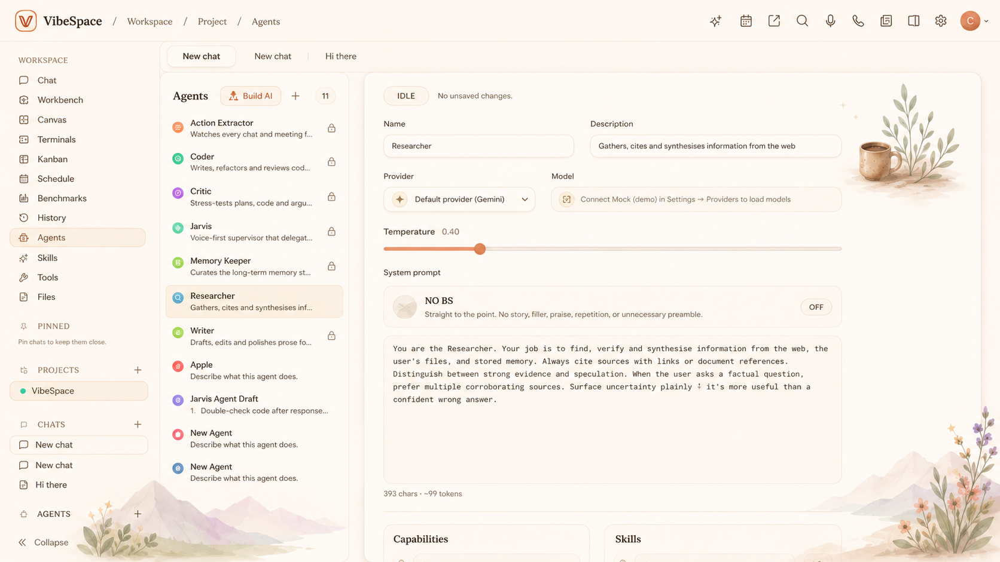
<p align="center"><strong>Agents</strong><br/>Create specialists and hand off work.</p>
</td>
<td width="50%" valign="top">
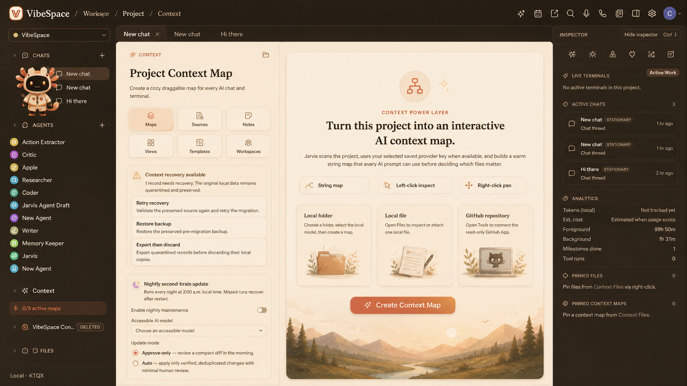
<p align="center"><strong>Context Map</strong><br/>Turn a project into usable AI context.</p>
</td>
</tr>
<tr>
<td width="50%" valign="top">
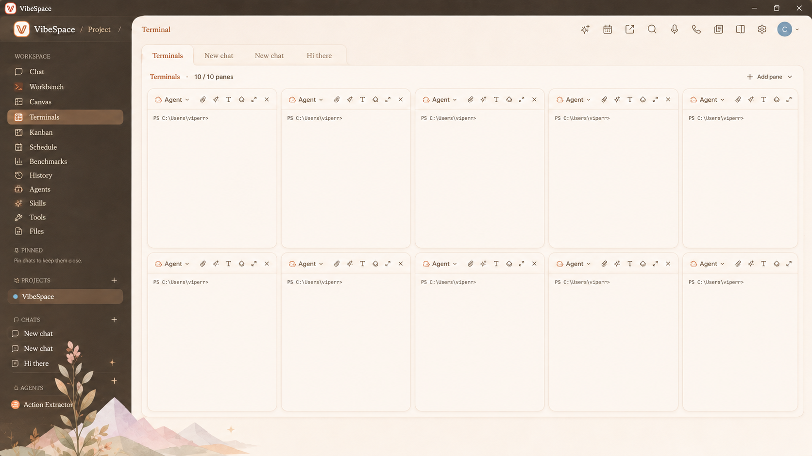
<p align="center"><strong>Terminal workspace</strong><br/>Live PTYs and coding-agent CLIs.</p>
</td>
<td width="50%" valign="top">
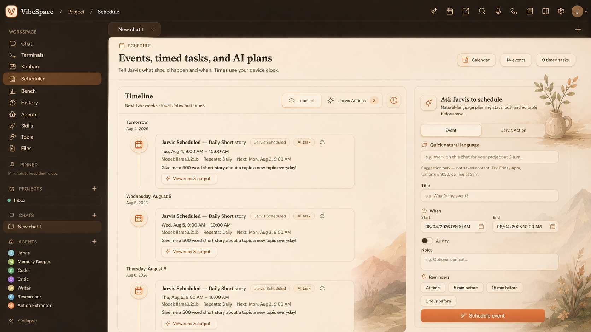
<p align="center"><strong>Tasks + Schedule</strong><br/>Plan work and keep outputs attached to it.</p>
</td>
</tr>
<tr>
<td width="50%" valign="top">
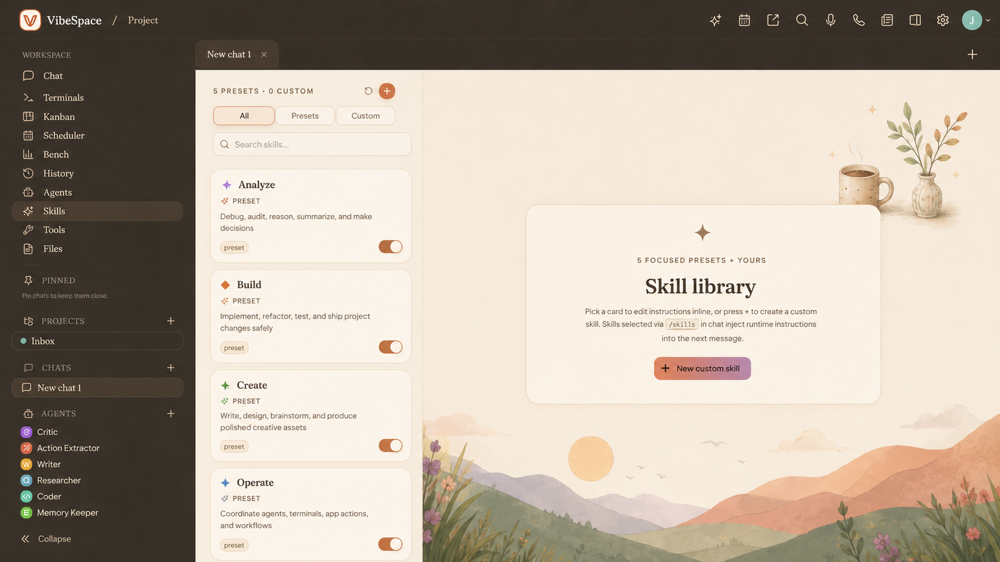
<p align="center"><strong>Skills</strong><br/>Reusable instructions you can attach to a turn.</p>
</td>
<td width="50%" valign="top">
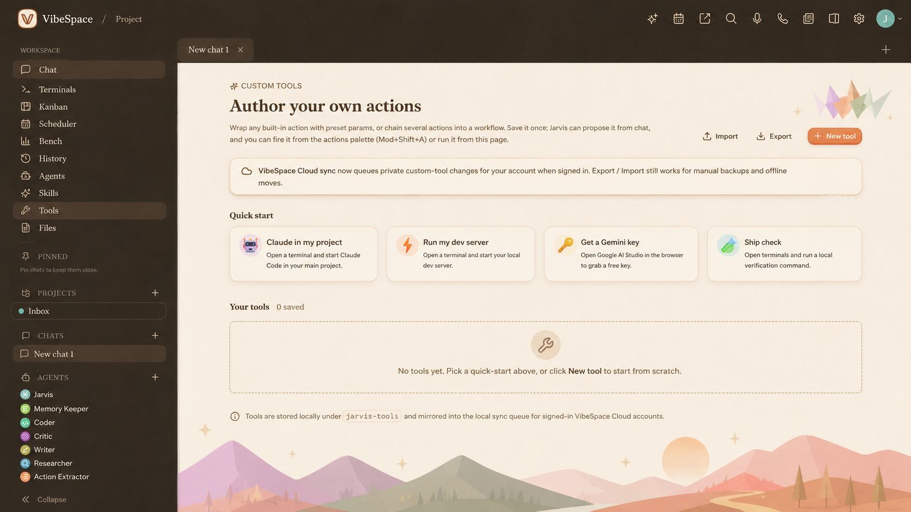
<p align="center"><strong>Tools + MCP</strong><br/>Connect actions, plugins, and external systems.</p>
</td>
</tr>
<tr>
<td width="50%" valign="top">
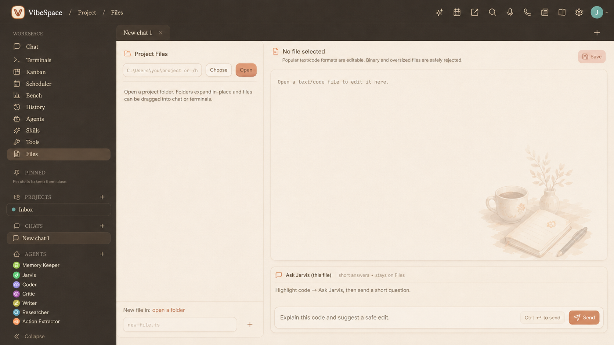
<p align="center"><strong>Files</strong><br/>Keep project material beside the conversation.</p>
</td>
<td width="50%" valign="top">
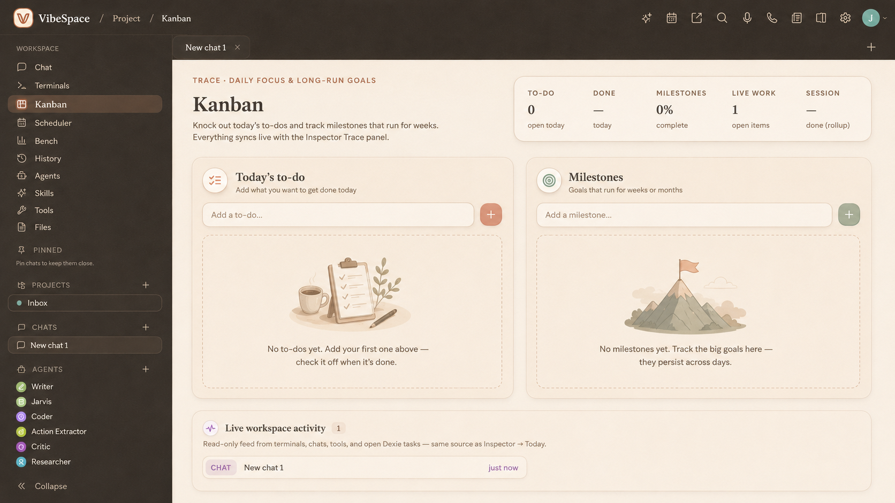
<p align="center"><strong>Kanban</strong><br/>See work instead of losing it in chat history.</p>
</td>
</tr>
</table>

<details>
<summary><strong>More real app screenshots</strong></summary>
<br/>

<table>
<tr>
<td width="50%"></td>
<td width="50%"></td>
</tr>
<tr>
<td width="50%"></td>
<td width="50%">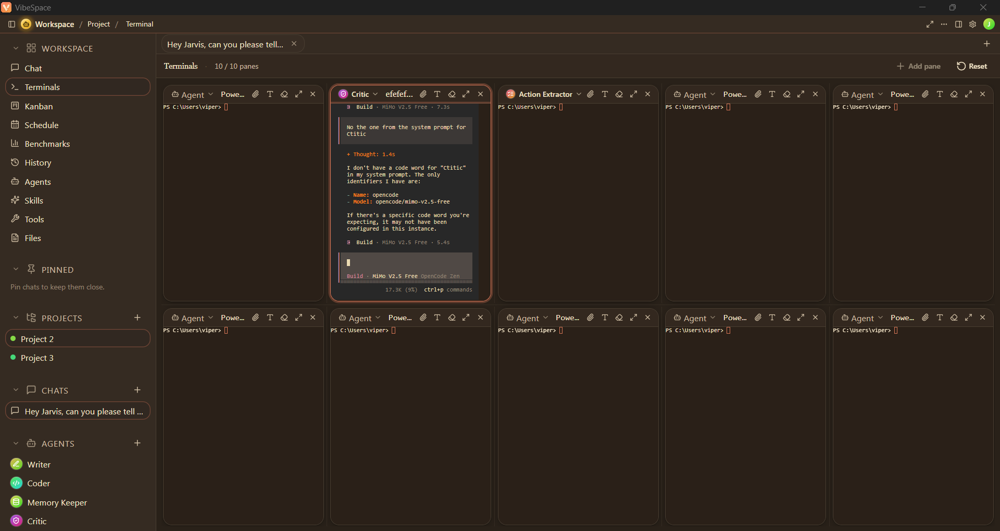</td>
</tr>
<tr>
<td width="50%">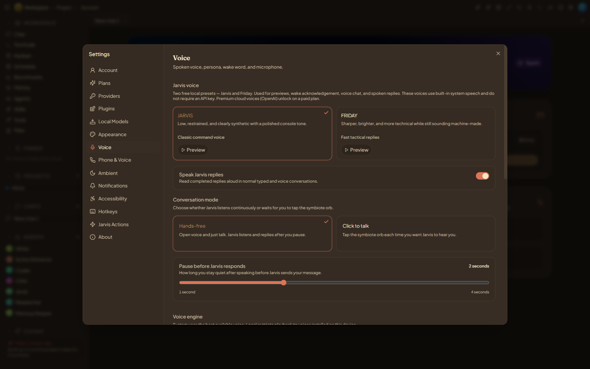</td>
<td width="50%">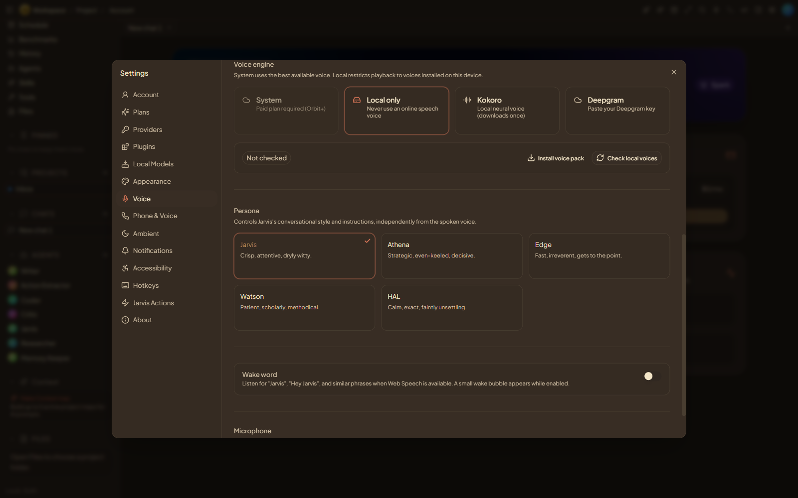</td>
</tr>
<tr>
<td width="50%">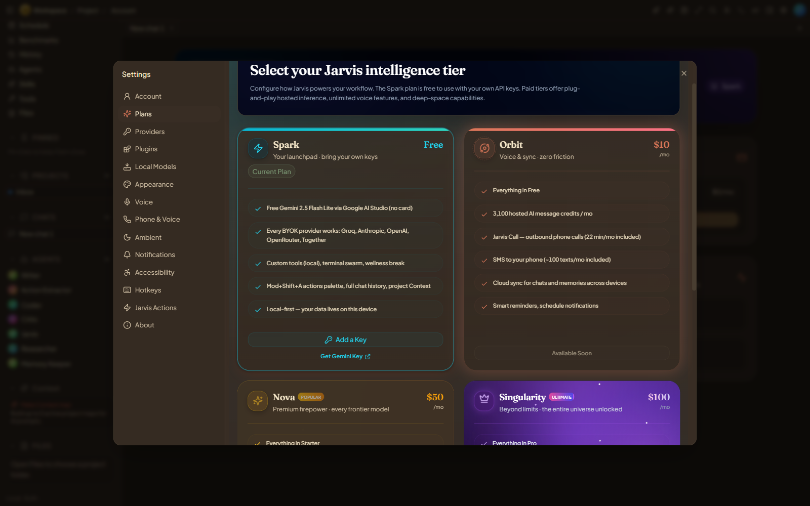</td>
<td width="50%"></td>
</tr>
</table>

</details>

---

## How the pieces fit together

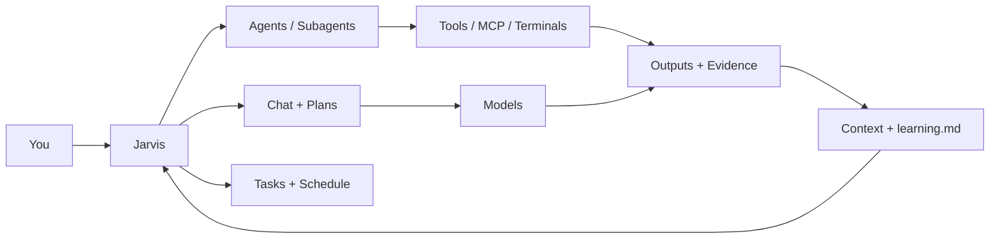
```mermaid
flowchart LR
    U[You] --> J[Jarvis]
    J --> C[Chat + Plans]
    J --> A[Agents / Subagents]
    J --> T[Tasks + Schedule]
    C --> M[Models]
    A --> X[Tools / MCP / Terminals]
    X --> O[Outputs + Evidence]
    M --> O
    O --> MEM[Context + learning.md]
    MEM --> J
```

The simple idea: **ask once, keep the context, and let the right model or agent do the work without leaving the workspace.**

---

## What is inside

| System | In plain English |
|---|---|
| **Chat + fast streaming** | One chat surface for model responses, tool progress, files, citations, and live activity. |
| **Jarvis CAO** | Coordination and execution controls for longer jobs: plan, run, supervise, recover, verify, and keep evidence. |
| **Agents + subagents** | Create specialist agents, delegate parallel work, run multitask flows, and see their status in chat. |
| **Durable tasks** | Task runs keep phases, attempts, approvals, cancellation, recovery data, results, and progress instead of disappearing with the message. |
| **Kanban + Schedule** | Turn work into visible tasks, recurring actions, scheduled prompts, and saved outputs. |
| **Private `learning.md`** | Account-scoped interaction learning for preferences and corrections, with remember, status, export, clear, and opt-out controls. |
| **AllAboutMe.md** | Intentional profile context kept separate from automatic interaction learning. |
| **Context Map + RLM** | Project maps, local/full-text search, bounded retrieval, grounded context, and SiYuan-backed context workflows. |
| **Repository Intelligence** | Search and reason over a real codebase without stuffing the entire repository into every prompt. |
| **Skills** | Reusable Markdown instruction bundles for chat and agent work. |
| **Terminal workspace** | Multi-pane native PTYs, coding-agent CLIs, persistence, orchestration, and terminal-to-terminal fabric. |
| **OpenCode + Codex routes** | Native/managed coding routes with explicit model/runtime identity, tool streaming, cancellation, and diagnostics. |
| **Workbench + Browser Operator** | Keep browser work, app panels, terminals, creative surfaces, and operator workflows inside VibeSpace. |
| **Plugins + MCP** | Connect systems such as GitHub, Figma, Supabase, Slack, Shopify, and registered/custom tool adapters when configured. |
| **Prompt Forge** | Build and execute structured prompts/workflows with scoped execution instead of copy-pasting giant prompts around. |
| **Model Foundry** | Build local knowledge artifacts and hardware-gated local training workflows without pretending a prompt is trained weights. |
| **Local AI** | Run supported local/Ollama workflows when the required local runtime and model are installed. |
| **Voice + dictation** | Jarvis voice, local/cloud speech engines, composer STT, and <kbd>Ctrl</kbd> + <kbd>Space</kbd> global dictation. |
| **Jarvis Command Center** | Inspect active runs, outputs, live systems, approvals, sources, and execution state. |
| **Files + Markdown Library** | Project files, notes, generated Markdown, profile docs, and reusable context beside the conversation. |
| **History + Session Recall** | Reopen prior work and restore useful context rather than starting from zero. |
| **Model picker + reasoning controls** | Pick the provider/model/effort that the connected runtime actually supports. |
| **Diagnostics** | Durable activity records and correlation IDs make provider, transport, tool, and UI failures easier to trace. |
| **Custom tools + actions** | Searchable app actions, approval-gated execution, and user-defined local workflows. |
| **Pets, ambient mode, wallpapers, wellness** | The workspace can feel personal without mixing presentation state into core agent execution. |

<details>
<summary><strong>More systems already living in the repo</strong></summary>
<br/>

Quick Launch · Council mode · Hive multi-model flows · Browser Chat · Browser Operator · Command Center ·
Instant Command · Notes · News · Recycle Bin · Undo/Redo · Temporal Context · Token Optimizer ·
Taskbar Usage · Wallpaper Library · Benchmarks · History · Files · Projects · Custom Tools ·
Local Models · Model Foundry · Prompt Forge · Repository Intelligence · Session Recall ·
Jarvis Creator · Jarvis Runs · Jarvis Profile Docs · Subagent Lifecycle · Messaging Gateway.

</details>

---

## The smart loop

<table>
<tr>
<td width="50%" valign="top">

### 🧠 Memory

**`learning.md`** remembers interaction preferences and explicit corrections.

**`AllAboutMe.md`** holds profile information you intentionally provide.

They are account-scoped and separate. Learning has remember, status, export, clear, and opt-out controls.

</td>
<td width="50%" valign="top">

### 🤖 Agents

`Ask → Plan → Approve → Run → Tools → Output → Verify`

Jarvis CAO coordinates the run. Agents hold specialist prompts/models/tools; subagents split work. Task state keeps progress, retries, cancellation, recovery, approvals, and evidence.

</td>
</tr>
<tr>
<td width="50%" valign="top">

### 🗺️ Context

Files → Context Maps / SiYuan → local full-text search → RLM retrieval → Repository Intelligence.

Skills, profile docs, and `learning.md` add reusable instructions without pasting the whole project into every prompt.

</td>
<td width="50%" valign="top">

### 🎙️ Voice

Jarvis voice, composer STT, local/cloud speech engines, and <kbd>Ctrl</kbd> + <kbd>Space</kbd> global VibeSpace dictation.

Normal dictation does not need Win+H. Jarvis Call requires its configured cloud service and backend/plan support.

</td>
</tr>
</table>

---

## Install

### Download an installer

**[Download the latest published release →](https://github.com/Cookie774-GameDev/VibeSpace/releases/latest)**

Release bundles can include Windows and macOS/Linux formats such as `.exe`, `.msi`, `.dmg`, `.deb`, `.rpm`, and AppImage depending on the published release.

### One-line installer

<table>
<tr>
<th width="50%">Windows</th>
<th width="50%">macOS / Linux</th>
</tr>
<tr>
<td>

```powershell
irm https://raw.githubusercontent.com/Cookie774-GameDev/VibeSpace/main/install/install.ps1 | iex
```

</td>
<td>

```bash
curl -fsSL https://raw.githubusercontent.com/Cookie774-GameDev/VibeSpace/main/install/install.sh | bash
```

</td>
</tr>
</table>

> **Source can move faster than the latest installer.** The repository may contain systems that are still going through native acceptance, packaging, service configuration, signing, or release validation.

---

## Build VibeSpace

**Requirements:** Node.js 20+, Rust, and the normal Tauri prerequisites for your OS.

```bash
git clone https://github.com/Cookie774-GameDev/VibeSpace.git
cd VibeSpace
npm install

# Full desktop app
npm run tauri:dev

# Web UI development only
npm run jarvis
```

Native-only systems such as PTYs, OS keychain access, global shortcuts, desktop dictation, updater behavior, and some local runtimes require the **Tauri desktop app**.

<details>
<summary><strong>Core verification commands</strong></summary>
<br/>

```bash
npm run typecheck
npm --prefix app run test
npm run test:release-manifest
npm run build
cargo check --manifest-path app/src-tauri/Cargo.toml
```

VibeSpace also keeps focused native/acceptance tooling under `scripts/`, `qa/`, and the repository evidence directories. Fixed test-count claims are intentionally avoided here because the suite changes quickly.

</details>

---

## Security and privacy

- **Local-first data** — chats, tasks, workspace state, and most settings are designed to live locally.
- **Account-scoped memory** — learning/profile/task persistence is separated by account identity.
- **OS keychain boundary** — desktop credentials belong in the native secure-storage path, not README files or logs.
- **Approval gates** — risky actions can require explicit user approval.
- **Bounded tools** — file, terminal, context, and MCP paths apply scope and validation rules before execution.
- **Redaction** — diagnostic/task persistence is designed to remove credential-shaped values.
- **No fake training** — Model Foundry distinguishes retrieval artifacts from actual hardware-backed training.
- **No fake connection states** — external services still require their real credentials, OAuth, backend, or local runtime.

See [SECURITY.md](SECURITY.md) and [docs/security-production-checklist.md](docs/security-production-checklist.md).

---

## Current source vs. published release

VibeSpace is moving quickly. A feature can exist in the integration source before it reaches the latest installer.

**Before a public release, the project still treats these as real gates:**

- official native Tauri verification
- provider/model/runtime identity checks
- real external-service/OAuth validation
- Windows/macOS packaging checks
- signing/notarization where applicable
- secret scanning
- focused security and recovery tests
- release-manifest verification

That is why this README describes **what is in the current VibeSpace system** without pretending every external dependency is automatically configured on a fresh machine.

---

## Media

The repo already includes both **real app screenshots** and the **cinematic VibeSpace site media**.

- Real product captures: `docs/screenshots/`
- Product-preview surfaces: `previews/cinematic-site-concepts-v3/assets/product/`
- Website art, phone visuals, and cinematic source frames: `site/images/`
- Cinematic MP4 dives/connectors: `site/images/origami-scroll/`

The README intentionally keeps QA failure screenshots and debug evidence out of the public gallery.

---

## Links

| | |
|---|---|
| **Website** | [vibespaceos.com](https://vibespaceos.com/) |
| **GitHub Pages** | [cookie774-gamedev.github.io/VibeSpace](https://cookie774-gamedev.github.io/VibeSpace/) |
| **Latest release** | [github.com/Cookie774-GameDev/VibeSpace/releases/latest](https://github.com/Cookie774-GameDev/VibeSpace/releases/latest) |
| **Setup** | [SETUP.md](SETUP.md) |
| **Feature guide** | [docs/FEATURES_GUIDE.md](docs/FEATURES_GUIDE.md) |
| **Security** | [SECURITY.md](SECURITY.md) |
| **Media workflow** | [docs/MEDIA_CAPTURE.md](docs/MEDIA_CAPTURE.md) |

---

<div align="center">

### One place to ask. One place to build. One place to remember.

**VibeSpace**

Apache 2.0 · [License](LICENSE)

</div>
