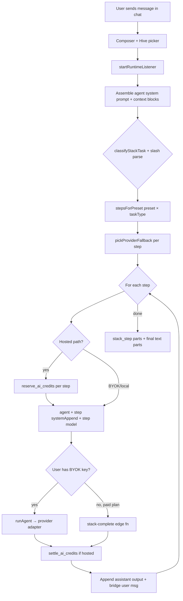

# Hive — Complete System Reference

**VibeSpace / Jarvis · Master implementation spec · June 2026**

This document is the **authoritative spec** for **Hive**: the sequential multi-model chat pipeline. It covers presets, frontier model roster, stack architecture, credit-bucket integration, terminal boundaries, UI surfaces, implementation phases, and a single master rebuild prompt for build agents.

> **Implementation status:** Hive stack code ships in **v0.1.42**. VibeBench and quota-slider UI remain planned — see linked plan docs.

> **Naming:** User-facing copy is always **Hive** (e.g. **Hive Fast**, **Hive Quality**). Internal code paths may still use `vibe_hive`, `stack_*`, or `StackPicker` historically — do not expose those names in UI or planning docs.

---

## 1. What Hive is

**Hive** is a **sequential multi-model pipeline** for the **app chat interface only**. Instead of one LLM answering in a single pass, the user picks a **preset** (Fast, Balanced, Quality, High, or Custom). Each preset runs **1–4+ steps**, where each step:

1. Uses a **different provider + model**
2. Gets a **step-specific system-prompt append**
3. Sees the **full chat history** plus **all prior step outputs** chained as assistant turns
4. Produces text that becomes input for the next step

The **final step's text** is what the user sees as the answer. Intermediate steps appear in a collapsible **Stack Timeline** in the chat thread.

**Default:** Hive is **Off** → normal single-model `runAgent()` path (composer model picker still applies).

**When Hive is On:** `runtime.ts` calls `runStack()` instead of `runAgent()` once per user send.

### 1.1 Surfaces where Hive applies

| Surface | Hive supported? | Credits (hosted)? |
|---------|:---------------:|:-----------------:|
| Main chat composer | ✓ | ✓ per step |
| Custom agents (chat) | ✓ | ✓ per step |
| Council mode (chat) | ✓ | ✓ per agent × steps |
| Terminals / PTY | **✗ never** | **✗ never** |
| Voice / PSTN / SMS | **✗ never** | **✗ never** |

See [§12 Terminal vs chat boundary](#12-terminal-vs-chat-boundary) for the hard exclusion rules.

---

## 2. Mental model



---

## 3. User-facing presets

| Mode ID | Label | Steps (general) | Cost / latency | Best for |
|---------|-------|-----------------|----------------|----------|
| `off` | Single model | 0 (bypass Hive) | Lowest | Default chat |
| `fast` | **Hive Fast** | 1 | Cheapest, fastest | Quick answers |
| `balanced` | **Hive Balanced** | 2 | Mid | Draft + check |
| `quality` | **Hive Quality** | 3 | High quality | Hard questions, production work |
| `high` | **Hive High** | 4 | Highest cost/latency | Frontier / ultra-tier reasoning |
| `custom` | **Hive Custom** | User-defined (default 2) | Varies | Power users |

**UI location:** Chat **Composer** → dropdown labeled **Hive** (`StackPicker` in `Composer.tsx`).

Options shown: `off`, `fast`, `balanced`, `quality`, `high`. (`custom` wired in auth store; expose in settings when custom-step editor ships.)

**Persistence:** `useAuthStore.stackPreset` (localStorage persist).

---

## 4. June 2026 frontier model roster

All Quality, High, and most Balanced steps pull IDs from **`app/src/lib/ai/stacks/frontierModels.ts`**. Update this single file when providers ship new SKUs.

| Key | API model ID | Provider | Role in Hive |
|-----|--------------|----------|--------------|
| `anthropic_opus` | `claude-opus-4-8` | anthropic | #1 reasoning, agentic coding, draft/plan/security |
| `anthropic_fable` | `claude-fable-5` | anthropic | Mythos-class audit (**suspended Jun 12 2026** — fall back to Opus) |
| `openai_flagship` | `gpt-5.5` | openai | General flagship, critique |
| `openai_flagship_pro` | `gpt-5.5-pro` | openai | Hardest reasoning tier |
| `openai_coding` | `gpt-5.5-codex` | openai | Codex / security code review |
| `google_flash` | `gemini-3.5-flash` | google | Fast polish, agentic loops (GA May 19 2026) |
| `google_pro` | `gemini-3.1-pro` | google | Long-context / research outline (until 3.5 Pro GA) |
| `grok` | `grok-4.3` | xai | Real-time / tools; `reasoning_effort: "high"` for **X High** |
| `deepseek_pro` | `deepseek-v4-pro` | deepseek | Cost-efficient coding implement |
| `deepseek_flash` | `deepseek-v4-flash` | deepseek | Fast draft tier |
| `qwen_max` | `qwen/qwen-3.7-max` | openrouter | Chinese frontier / value |
| `kimi_k26` | `moonshotai/kimi-k2.6` | openrouter | Long-horizon agent |
| `perplexity_sonar` | `perplexity/sonar` | openrouter | Research fact-check |
| `mistral_large` | `mistral-large-latest` | mistral | EU frontier option |

**Grok X High:** not a separate model string — pass `GROK_HIGH_REASONING_EFFORT = 'high'` as provider option on `grok-4.3`. Wire in stack runner when adding Grok steps to **Hive High**.

---

## 5. Every preset — exact steps

### 5.1 Fast (`fast`) — general

| Step | Label | Provider | Model | Temp | systemAppend |
|------|-------|----------|-------|------|--------------|
| answer | Answer | google | `gemini-3.5-flash` | 0.5 | Answer directly in one pass. Be concise. |

### 5.2 Balanced (`balanced`) — general

| Step | Label | Provider | Model | Temp | systemAppend |
|------|-------|----------|-------|------|--------------|
| draft | Draft | google | `gemini-3.5-flash` | 0.6 | Produce a complete first draft. Structure clearly. |
| check | Check | anthropic | `claude-opus-4-8` | 0.3 | Review the draft above. Fix factual errors and unclear phrasing. Return the improved final answer only — no meta commentary. |

### 5.3 Quality (`quality`) — general

| Step | Label | Provider | Model | Temp | max_tokens | systemAppend |
|------|-------|----------|-------|------|------------|--------------|
| draft | Draft | anthropic | `claude-opus-4-8` | 0.7 | — | Produce a thorough first draft. |
| critique | Critique | openai | `gpt-5.5` | 0.4 | — | Critique the draft: list issues (accuracy, structure, missing steps). Then provide a revised version that fixes them. Output only the revised answer. |
| polish | Polish | google | `gemini-3.5-flash` | 0.3 | 4096 | Tighten the answer. Remove redundancy. Return the final polished version only. |

**Quality flow:** Opus drafts → GPT-5.5 critiques and revises → Gemini 3.5 Flash tightens prose.

### 5.4 High (`high`) — general (frontier / ultra tier)

| Step | Label | Provider | Model | Temp | Options | systemAppend |
|------|-------|----------|-------|------|---------|--------------|
| orient | Orient | xai | `grok-4.3` | 0.5 | `reasoning_effort: high` | Analyze the question. Identify constraints, risks, and the best solution shape. Output a structured brief for downstream steps. |
| draft | Draft | anthropic | `claude-opus-4-8` | 0.7 | — | Using the brief above, produce a thorough first draft. |
| harden | Harden | openai | `gpt-5.5-codex` | 0.3 | — | Stress-test reasoning and correctness. Fix logic gaps. Return the improved answer only. |
| polish | Polish | google | `gemini-3.5-flash` | 0.3 | max_tokens 4096 | Final polish. Remove redundancy. Return the final answer only. |

**High flow:** Grok X High orients → Opus drafts → Codex hardens → Gemini 3.5 Flash polishes. VibeBench simulation of this topology ≈ **94.4** composite vs single-model Opus ≈ **90.7**.

---

## 6. Task overrides (classifier changes the pipeline)

Before presets run, **`classifyStackTask(userText)`** picks a **task type**. If that task has an override for the active preset, **the override replaces the general preset steps**.

### 6.1 Classifier rules (regex, no extra LLM call)

| Task | Triggers (examples) | Priority |
|------|---------------------|----------|
| `review` | review, critique, audit, feedback, grade | Highest |
| `research` | research, compare, sources, cite, summarize | |
| `code` | code, bug, fix, implement, typescript, api, test | |
| `write` | write, draft, email, blog, essay, copy | |
| `general` | (default) | Lowest |

### 6.2 Code task overrides

**Balanced code:**

| Step | Provider | Model | systemAppend |
|------|----------|-------|--------------|
| Plan | deepseek | `deepseek-v4-pro` | Outline the implementation approach in bullets, then write the code. |
| Review | anthropic | `claude-opus-4-8` | Review the code for bugs and edge cases. Return the fixed final code only. |

**Quality code:**

| Step | Provider | Model | max_tokens | systemAppend |
|------|----------|-------|------------|--------------|
| Plan | anthropic | `claude-opus-4-8` | — | Write a short implementation plan, then the code. |
| Implement | deepseek | `deepseek-v4-pro` | 8192 | Implement based on the plan. Match project conventions. |
| Review | openai | `gpt-5.5-codex` | — | Security and correctness review. Return the final code only. |

**High code:** Quality code chain + prepend Grok orient step (same as High general orient).

### 6.3 Write task overrides

**Balanced write:** Opus draft → Gemini 3.5 Flash edit.

**Quality write:** Opus draft → GPT-5.5 edit → Gemini 3.5 Flash tighten.

**High write:** Grok orient → Opus draft → GPT-5.5 edit → Gemini 3.5 Flash tighten.

### 6.4 Review task overrides

**Fast review:** single Opus step (review + verdict).

**Quality review:** GPT-5.5 rubric score → Opus fixes → Gemini 3.5 Flash executive summary.

**High review:** Grok orient → GPT-5.5 rubric → Opus fixes → Gemini 3.5 Flash summary.

### 6.5 Research task overrides

**Balanced research:** Gemini 3.1 Pro outline → Opus synthesize.

**Quality research:** same + **Perplexity Sonar** fact-check via OpenRouter.

**High research:** Grok orient → Gemini 3.1 Pro outline → Opus synthesize → Perplexity Sonar fact-check.

---

## 7. Custom Hive

**Storage:** `auth.stackCustomSteps: StackStepSpec[]`

**Default when empty** (`DEFAULT_CUSTOM_STEPS`):

| Step | Provider | Model | systemAppend |
|------|----------|-------|--------------|
| Local draft | groq | `llama-3.3-70b-versatile` | First pass answer. |
| Cloud polish | google | `gemini-3.5-flash` | Polish the draft. Final answer only. |

Set preset to `custom` and populate `stackCustomSteps` via `setStackCustomSteps()`. Settings UI for editing steps is planned.

---

## 8. Slash commands

Prefix messages to override preset and/or task without changing the picker:

```
/hive quality write Fix the onboarding copy for our landing page
/stack balanced code Add retry logic to the fetch wrapper
/hive high code Refactor the auth middleware
/hive fast
```

**Parser:** `parseStackSlashCommand()` — regex `^\s*\/(?:hive|stack)(?:\s+(\w+))?(?:\s+(\w+))?\s*`

| Token 1 | Maps to preset |
|---------|----------------|
| fast, balanced, quality, high, custom, off | `StackPresetId` |

| Token 2 | Maps to task |
|---------|----------------|
| write, code, review, research, general | `StackTaskType` |

Remaining text after the slash prefix becomes the **user question**.

**Precedence:** slash preset beats stored `stackPreset` when slash preset ≠ off.

---

## 9. System prompt — how context works

Every Hive step shares the **same base agent** but with a **per-step overlay**.

### 9.1 What gets built BEFORE `runStack()`

`runtime.ts` builds `runnable: Agent` with this **system_prompt order** (each block skipped if empty):

1. **Project context** — `getProjectContextBlock(projectId)`
2. **Project context tree** — `getProjectContextTreeBlock`
3. **Plugin context** — connected integrations for this turn
4. **Plugin status** — mention-triggered plugin state
5. **Selected skills** — `/skills` slash attachments
6. **Explicit context nodes** — user-attached context map nodes
7. **Explicit files** — user-attached file paths (16 KiB total budget)
8. **Explicit terminals** — attached terminal session refs (read-only context for chat; does **not** enable Hive in terminals)
9. **Connected files** — files pinned to panes bound to this agent slug
10. **Terminal transcript** — live CLI output for chat context (`buildAgentTerminalContext`) — **context only, not inference path**
11. **AI completion instruction** — `getAiCompletionInstruction()`
12. **Agent's own `system_prompt`** — persona, catalogue, action proposals

For **Jarvis** only, also applied before context:

- `applyPersona(agent, personaPreset)`
- `applyAvailableActions(runnable)`

### 9.2 What each Hive step adds

Inside `runStep()` (`runner.ts`):

```ts
system_prompt: `${baseAgent.system_prompt}

--- Stack step: ${step.label} ---
${step.systemAppend}`
```

Also per step:

- `model: { provider: step.provider, model: step.model }`
- `temperature: step.temperature ?? baseAgent.temperature`
- `max_output_tokens: step.max_output_tokens ?? baseAgent.max_output_tokens`

**Important:** Context is **not** re-fetched per step. The full assembled system prompt is frozen at run start; only the **step append** and **model** change.

### 9.3 Step handoff — messages each step sees

Initial messages:

```
[...chat history excluding duplicate last user turn...]
{ role: 'user', content: userQuestion }
```

After step *i* completes (if not last step), append:

```
{ role: 'assistant', content: stepOutput }
{ role: 'user', content: 'Continue to the next stack step (${nextLabel}). Use the content above as input.' }
```

Step 2 sees step 1's full output as an assistant message, plus an explicit bridge instruction. Step 3 sees steps 1+2, etc.

**Design intent:** Later models **critique/refine** earlier output without a hidden channel. Step-specific behavior lives in `systemAppend`.

---

## 10. Provider fallback

If the user lacks an API key for a step's provider, `pickProviderFallback()` rewrites the step to the first available provider in order:

```
google → groq → anthropic → openai → deepseek → openrouter
```

The **model string is unchanged** — if fallback provider doesn't host that SKU, the router may error. Production path: user should have keys for Quality/High providers, use hosted `stack-complete`, or pick a lower preset.

---

## 11. Hosted path — `stack-complete` vs BYOK

### 11.1 Routing per step

When `providerHasKey(step.provider)` is false **and** `canUseHostedStack(plan)` (any paid plan except `free` / `byok-only`):

→ `runHostedStackStep()` POSTs to Supabase edge function **`stack-complete`**.

When user has BYOK key → `runAgent()` directly (**no credits**).

When no key and no hosted entitlement → attempt BYOK/local fallback chain; **no silent overage** (PAYG only if opt-in).

### 11.2 `stack-complete` request

```json
{
  "provider": "anthropic",
  "model": "claude-opus-4-8",
  "system": "<full step system prompt>",
  "messages": [...],
  "temperature": 0.7,
  "max_tokens": 4096,
  "stream": true
}
```

**Server checks:** JWT auth → **reserve AI credits** (model-agnostic) → model in **ALLOWED** allowlist → stream SSE deltas → **settle credits** on completion.

Frontier models on allowlist (Jun 2026): Opus 4.8, Fable 5, GPT-5.5 family, Gemini 3.5 Flash / 3.1 Pro, DeepSeek V4, Grok 4.3, Kimi K2.6, Qwen 3.7 Max, Perplexity Sonar, legacy SKUs for compat.

Platform keys live in Supabase env (`ANTHROPIC_API_KEY`, `OPENAI_API_KEY`, etc.).

### 11.3 Credit bucket integration (each step)

Hive is **model-agnostic** for credits. Each hosted step draws from the user's **AI credit slice** — the portion of their monthly subscription pool allocated to **AI credits** via **Settings → Plans** quota sliders (defaults in [`SUBSCRIPTION_QUOTA_SLIDERS_AND_PAYG.md`](plans/SUBSCRIPTION_QUOTA_SLIDERS_AND_PAYG.md)).

1. **Reserve** — `estimateModelCostUsd(step.model, est_tokens)` → `reserve_ai_credits`
2. **Call** — upstream provider via `stack-complete`
3. **Settle** — `actualModelCostUsd` → `settle_ai_credits`; refund delta if over-reserved

A **3-step Quality** hive on hosted path ≈ **3 separate credit events**. **Hive High** (4 steps) ≈ **4×**. Council + Hive multiplies further (agents × steps).

**Exhaustion:** Return `budget_exceeded`; client falls back to **BYOK → local**. **No silent overage** — optional **PAYG AI add-ons** only when user explicitly enables them (`addon_charge_usd = base_inference_cost_usd × 1.05`).

See [`docs/plans/AI_CREDIT_BUCKET_AND_ULTRA_TIER.md`](plans/AI_CREDIT_BUCKET_AND_ULTRA_TIER.md) for bucket math and Supernova 2× caps.

---

## 12. Terminal vs chat boundary

Terminals **never** consume hosted subscription models or the AI credit bucket. This is a **hard product boundary**, not a metering detail.

```text
┌─────────────────────────────────────────────────────────────────────────┐
│                        INFERENCE SURFACES                                │
├──────────────────────────────┬──────────────────────────────────────────┤
│  CHAT INTERFACE (Hive OK)    │  TERMINALS (Hive NEVER)                   │
├──────────────────────────────┼──────────────────────────────────────────┤
│  Main composer               │  PTY / shell sessions                     │
│  Agent chat (@mentions)      │  Terminal-attached agents                 │
│  Council chat                │  Terminal swarm inference                 │
│  Action-approval LLM turns   │  Cloud inference from terminal context    │
├──────────────────────────────┼──────────────────────────────────────────┤
│  Hosted: stack-complete      │  BYOK only OR local (Ollama)             │
│  Credits: YES (per step)     │  Credits: NO                             │
│  Hive presets: YES           │  Hive presets: NO (single-model only)     │
└──────────────────────────────┴──────────────────────────────────────────┘
```

| Capability | Chat + Hive | Terminals |
|------------|:-----------:|:---------:|
| Hive stack pipelines | ✓ | ✗ |
| `stack-complete` hosted | ✓ (paid, no BYOK) | ✗ |
| AI credit bucket | ✓ | ✗ |
| Company-hosted models | ✓ | ✗ |
| BYOK provider keys | ✓ | ✓ (only path for cloud) |
| Local models (Ollama) | ✓ | ✓ |
| Terminal transcript as **chat context** | ✓ (read into Hive steps) | N/A |

**Implementation guard:** `runtime.ts` Hive branch runs only on `jarvis:send` chat path. Terminal inference entrypoints must **not** import `runStack()` or call `stack-complete`. Grep CI check recommended.

---

## 13. Runtime integration (`runtime.ts`)

On `jarvis:send`:

1. Resolve agent (mention, chat default, etc.)
2. Build `runnable` with full context (§9)
3. Create assistant placeholder message
4. `historyForStack` = LLM messages **minus** trailing user turn
5. Call `runStack({ agent: runnable, userText: text, history, signal, callbacks })`
6. If `stackResult === null` (preset `off`) → fall through to single `runAgent()`
7. If stack ran:
   - Stream via callbacks → accumulate `stack_step` parts
   - Final message parts: `[...stackStepParts, ...textToParts(finalText)]`
   - Usage aggregates all steps' tokens + cost
   - Agent verb shows current step label (`draft`, `critique`, …)

**Chat message part type** (`types/chat.ts`):

```ts
{
  kind: 'stack_step',
  step_id: string,
  label: string,
  provider: ProviderId,
  model: string,
  text: string,
  status: 'running' | 'done' | 'error',
  input_tokens?: number,
  output_tokens?: number,
  cost_usd?: number,
  duration_ms?: number,
  credits_used?: number,  // hosted steps only
}
```

**UI:** `MessagePart.tsx` renders first `stack_step` index as `<StackTimeline steps={all stack_steps} />` — collapsible per-step output, provider/model, cost, credits, duration.

---

## 14. UI surfaces

| Surface | Component | Behavior |
|---------|-----------|----------|
| Composer | `StackPicker` | Dropdown: Off / Hive Fast / Balanced / Quality / High |
| Chat thread | `StackTimeline` | Collapsible step timeline under assistant reply |
| Message parts | `MessagePart.tsx` | Renders `stack_step` metadata + streamed text |
| Settings (planned) | Custom step editor | Edit `stackCustomSteps` when preset = Custom |
| Usage meter | Plans / composer footer | Show credits remaining; warn on low bucket |

Timeline header copy: **"Hive · N steps"** (not "Vibe Hive").

---

## 15. Terminal swarm bridge (context only)

**Not inside Hive runner** but feeds **terminal context** that Hive chat steps may read:

- `terminalSwarmBridge.ts` watches `transcriptStore` writes
- Publishes `jarvis:terminal:swarm-update` when an agent-bound pane gets fresh output
- `buildAgentTerminalContext(agent.slug)` prepends latest transcript (10 min freshness)

Use case: **Hive Quality code** in **chat** + live terminal → Opus/GPT-5.5 steps reason over CLI output in system prompt block 10. The terminal itself still uses BYOK/local only.

---

## 16. VibeBench (how Hives are scored)

**Location:** `benchmarks/vibebench/`

| Category | Weight | What it measures |
|----------|--------|------------------|
| HiveQuality | 25% | Multi-step pipeline output quality (judge) |
| TerminalAware | 15% | Uses terminal context correctly in **chat** |
| ToolActions | 15% | Parses action JSON fences |
| CodeCorrect | 20% | Deterministic test pass |
| Security | 10% | Regex + judge |
| Latency | 10% | tok/s |
| CostEfficiency | 5% | score / USD |

**Simulation:** `simulate-hive-topologies.mjs` — top simulated Hive High topology ≈ **94.4** vs Fable 5 single ≈ **90.7**.

**Local runner:** `node scripts/vibebench-run.mjs --models anthropic:claude-opus-4-8,openai:gpt-5.5,google:gemini-3.5-flash`

---

## 17. File map (build checklist)

| File | Responsibility |
|------|----------------|
| `stacks/types.ts` | `StackPresetId` (+ `high`), `StackTaskType`, `StackStepSpec`, results |
| `stacks/frontierModels.ts` | Pinned June 2026 API IDs |
| `stacks/presets.ts` | FAST / BALANCED / QUALITY / HIGH / TASK_OVERRIDES / CUSTOM |
| `stacks/classifier.ts` | Task regex + `/hive` slash parser |
| `stacks/runner.ts` | `runStack()` orchestration, step chaining, credit hooks |
| `stacks/hostedStack.ts` | `stack-complete` client + reserve/settle |
| `stacks/index.ts` | Public exports |
| `lib/ai/runtime.ts` | Context assembly + Hive vs single-model branch |
| `lib/ai/context.ts` | Project/files/terminal context blocks |
| `lib/ai/router.ts` | `runAgent()` per provider |
| `stores/auth.ts` | `stackPreset`, `stackCustomSteps` persist |
| `features/chat/Composer.tsx` | `StackPicker` UI |
| `features/chat/StackTimeline.tsx` | Step timeline UI |
| `features/chat/MessagePart.tsx` | Renders `stack_step` parts |
| `types/chat.ts` | `stack_step` part schema |
| `supabase/functions/stack-complete/` | Hosted frontier steps + credit RPCs |
| `benchmarks/vibebench/*` | Benchmark spec + simulation |

**Tests:** `presets.test.ts`, `classifier.test.ts`, `runner` via runtime integration, `terminalSwarmBridge.test.ts`, terminal-never-calls-stack guard test.

---

## 18. Implementation phases

### Phase 1 — Types & presets
- [ ] `StackPresetId` includes `high`
- [ ] `frontierModels.ts` with June 2026 IDs
- [ ] `presets.ts`: Fast, Balanced, Quality, **High**, task overrides, Custom default
- [ ] Unit tests for step counts and High topology

### Phase 2 — Classifier & slash commands
- [ ] `classifyStackTask()` regex (no meta-LLM on hot path)
- [ ] `parseStackSlashCommand()` — `/hive` and `/stack` aliases
- [ ] `effectiveStackPreset()` precedence

### Phase 3 — Runner & handoff
- [ ] `runStack()` step loop, bridge messages, aggregated usage
- [ ] `pickProviderFallback()`
- [ ] Stream callbacks → `stack_step` parts

### Phase 4 — Hosted path & credits
- [ ] `stack-complete` edge function (or extend `hosted-inference-complete`)
- [ ] Per-step `reserve_ai_credits` / `settle_ai_credits`
- [ ] BYOK bypass (zero credits)
- [ ] Exhaustion → BYOK/local fallback (**no silent overage**; PAYG if opt-in)

### Phase 5 — Runtime wiring
- [ ] `runtime.ts` context assembly (§9)
- [ ] `jarvis:send` Hive branch
- [ ] **Explicit exclusion:** terminal paths never call `runStack`

### Phase 6 — UI
- [ ] `StackPicker` in composer (Hive Fast / Balanced / Quality / High)
- [ ] `StackTimeline` collapsible steps
- [ ] Credits per step in timeline (hosted only)

### Phase 7 — QA
- [ ] Quality hive = 3 hosted credit events
- [ ] High hive = 4 hosted credit events
- [ ] Terminal agent with context attached → chat Hive sees transcript; terminal inference still BYOK
- [ ] Supernova 2× credit cap applies to Hive burns

---

## 19. How to use (end user)

1. Open chat composer.
2. Set **Hive** dropdown: Fast / Balanced / Quality / High.
3. Ask normally. For code/research/review, use keywords or `/hive quality code …`.
4. Expand **Hive · N steps** in the reply to inspect each model's output.
5. Ensure API keys for providers in your chosen mode **or** use a paid plan for hosted steps (draws from AI credit bucket).
6. Terminals: add your own API keys or use local models — they never use Hive credits or hosted stack.

---

## 20. Master rebuild prompt

Copy everything below into a new agent session to rebuild **Hive** from zero on current `main`:

---

```
Build "Hive" — a sequential multi-model CHAT pipeline for a Tauri + React AI workspace.
Terminals are OUT OF SCOPE for Hive and hosted credits.

REQUIREMENTS

1. TYPES (stacks/types.ts)
   - StackPresetId: 'off' | 'fast' | 'balanced' | 'quality' | 'high' | 'custom'
   - StackTaskType: 'general' | 'write' | 'code' | 'review' | 'research'
   - StackStepSpec: { id, label, provider, model, systemAppend, temperature?, max_output_tokens?, provider_options? }
   - StackRunResult: finalText, steps[], aggregated usage, taskType, preset

2. FRONTIER MODELS (stacks/frontierModels.ts) — pin June 2026 IDs (see docs/HIVE.md §4)

3. PRESETS (stacks/presets.ts)
   FAST: 1 step — gemini-3.5-flash
   BALANCED: gemini-3.5-flash draft → claude-opus-4-8 check
   QUALITY: claude-opus-4-8 draft → gpt-5.5 critique → gemini-3.5-flash polish
   HIGH: grok-4.3 (reasoning_effort high) orient → opus draft → gpt-5.5-codex harden → gemini-3.5-flash polish
   TASK_OVERRIDES for code/write/review/research (see docs/HIVE.md §6)
   CUSTOM default: groq local draft → gemini-3.5-flash polish
   stepsForPreset(preset, taskType, customSteps?) — task override wins
   pickProviderFallback(step, availableProviders)

4. CLASSIFIER (stacks/classifier.ts)
   - Regex classifyStackTask — review > research > code > write > general
   - parseStackSlashCommand: /hive|/stack [preset] [task]
   - effectiveStackPreset(userPreset, slashPreset)

5. RUNNER (stacks/runner.ts) — runStack(opts):
   - If preset off → return null
   - FOR each step: stepAgent with systemAppend + model
   - Hosted (no BYOK, paid plan): stack-complete + reserve/settle AI credits PER STEP
   - Else runAgent (BYOK — no credits)
   - Chain assistant output + bridge user message between steps
   - Return aggregated result

6. RUNTIME (lib/ai/runtime.ts)
   - Assemble base system_prompt once (project, plugins, skills, files, terminal CONTEXT read-only)
   - jarvis:send chat only: runStack OR single runAgent
   - TERMINAL INFERENCE: never runStack, never stack-complete, never credit RPCs

7. AUTH (stores/auth.ts) — persist stackPreset (default 'off'), stackCustomSteps[]

8. UI — StackPicker (Off/Fast/Balanced/Quality/High), StackTimeline, stack_step parts
   Labels: "Hive Fast" etc. — never "Vibe Hive"

9. HOSTED (supabase/functions/stack-complete)
   JWT + AI credit reserve/settle + ALLOWED frontier models → SSE stream

10. CREDITS — model-agnostic bucket from user's AI slider allocation; no silent overage; optional PAYG at base×1.05
    Supernova ($200) = 2× Singularity credits including all Hive hosted steps

11. TESTS — presets, classifier, runner, terminal-never-hive guard

Read docs/HIVE.md and docs/plans/AI_CREDIT_BUCKET_AND_ULTRA_TIER.md before coding.
DO NOT use meta-LLM task classification on hot path.
DO NOT re-fetch context per step.
Final user-visible answer = last step output; earlier steps in timeline only.
```

---

## 21. Related documents

| Document | Purpose |
|----------|---------|
| [`docs/plans/AI_CREDIT_BUCKET_AND_ULTRA_TIER.md`](plans/AI_CREDIT_BUCKET_AND_ULTRA_TIER.md) | Unified AI credit bucket, Supernova tier, Hive credit rules |
| [`docs/plans/SUBSCRIPTION_QUOTA_SLIDERS_AND_PAYG.md`](plans/SUBSCRIPTION_QUOTA_SLIDERS_AND_PAYG.md) | Quota sliders (AI / call / SMS) + PAYG add-ons — Hive draws AI slice |
| [`docs/SUBSCRIPTION_PLANS_REFERENCE.md`](SUBSCRIPTION_PLANS_REFERENCE.md) | Plan ladder and entitlements |
| `CHANGELOG.md` | v0.1.40 Hive ship; v0.1.41 rollback note |

---

*Document path: `docs/HIVE.md` · Supersedes `docs/VIBE_HIVE.md`*
