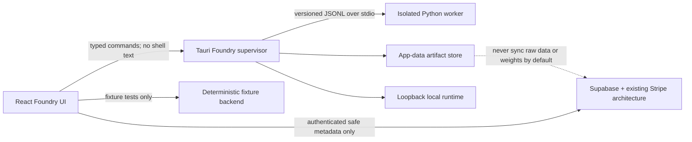

# VibeModel Foundry architecture

## Product boundary

**Build Your Own AI** is the user-facing feature. **VibeModel Foundry** is the internal subsystem. **VibeCoder** is the first bundled specialist template. A VibeSpace Agent remains the workflow/prompt/tool wrapper; a Foundry model version is an immutable base-model revision plus adapter and evaluation evidence. The two are connected only after explicit promotion and healthy local-runtime registration.

## Trust and storage boundaries



## Frontend

`app/src/features/model-foundry/` owns:

- versioned domain contracts and validators;
- deterministic fixture workflow;
- local repository adapter used by fixture/web tests;
- create wizard, overview, project dashboard, Dataset Studio, Training Lab, Evaluation Arena, Model Registry, Improve, and entitlement messaging;
- a single client interface implemented by fixture and native adapters;
- explicit user approvals for downloads, training, feedback inclusion, promotion, rollback, deletion, and billing navigation.

The first navigation seam is the existing Agents surface. Shared route files are integrated only after conflict revalidation. Existing provider/model registries remain the source for local runtime selection.

## Native supervisor

`app/src-tauri/src/model_foundry/` will own a `FoundryState` and focused modules:

- `paths`: fixed app-data roots, identifier validation, atomic two-generation documents;
- `hardware`: conservative CPU/RAM/disk/GPU capability inventory with explicit unknown values;
- `jobs`: durable snapshots, monotonic events, cancellation, timeout, and restart reconciliation;
- `artifacts`: license/source/checksum/size manifests and verified promotion;
- `process`: distinct executable arguments, stdin-only user payloads, bounded/redacted logs, hidden Windows processes, process-tree termination;
- `ollama`: loopback-only runtime registration and health checks.

The renderer receives one stable `model-foundry://event` envelope and must reconcile with snapshot commands after mount/reload. Events never constitute durable truth.

## Worker protocol

The worker is an opt-in project-scoped Python environment under `workers/vibemodel-foundry/`. It uses pinned dependencies and never changes a global interpreter, WSL, PATH, shell profile, or system package set.

Transport is newline-delimited, versioned JSON over stdio:

- command: `requestId`, `jobId`, `protocolVersion`, `operation`, immutable manifest path, options;
- event: `requestId`, `jobId`, `sequence`, `phase`, progress, resource sample, recoverability, structured error;
- terminal result: exactly one of completed, cancelled, failed, or interrupted.

User-controlled content is never interpolated into a command or shell. The supervisor caps input, output, runtime, file size, and concurrency.

## Artifact store

The native store uses a fixed subtree of Tauri's application data directory:

```text
model-foundry/
  projects/<project-id>/project.json
  datasets/<dataset-id>/<version>/manifest.json
  datasets/<dataset-id>/<version>/examples.jsonl
  jobs/<job-id>/snapshot.json
  models/<model-id>/<version>/model-card.json
  models/<model-id>/<version>/adapter/
  evaluations/<run-id>/run.json
  audit/events.jsonl
```

Identifiers are constrained or hashed. Manifests are schema-versioned and content-addressed. Writes use unique same-directory temporary files, flush/sync, atomic replace, and a last-known-good generation. Stale `running` jobs become `interrupted`; they never become successful on restart.

## Dataset lifecycle

Imported examples carry explicit source, consent, split, label, and lineage metadata. Validation performs format checks, secret/privacy scanning, exact and normalized deduplication, quality gates, and train/evaluation leakage checks. A dataset version is immutable once referenced by a job. Synthetic or teacher-generated data is labeled and cannot be used as independent judge evidence.

## Training lifecycle

The fixture backend proves orchestration without real compute. The real worker supports LoRA and QLoRA only when hardware and model compatibility permit. Each run binds an immutable base revision, dataset version, configuration, seed, dependency lock, and output manifest. Resource guards may pause/cancel safely. OOM recovery is conservative and cannot silently change the scientific comparison.

## Evaluation and promotion

Every candidate is evaluated against the base and current champion on a versioned suite. Results retain per-case evidence, aggregate metrics, safety failures, and judge provenance. Hidden evaluation inputs are unavailable to training and synthetic generation. A candidate is promotable only when all configured gates pass and a user explicitly approves it. Promotion retains the previous champion as a rollback target.

## Deployment

Supported promoted adapters are registered through VibeSpace's existing local-model/Ollama routing. Health is verified before the picker advertises the version. Registration failure leaves the champion record intact and produces a recoverable error. Rollback re-registers a previously promoted version; it never deletes later evidence.

## Cloud and billing

Supabase stores authenticated user-owned project/model/evaluation/feedback metadata, entitlements, idempotent usage records, and audit events. It does not receive raw datasets, prompts, weights, checkpoints, or feedback bodies by default. RLS enforces owner/member scope and privileged mutations remain server-side.

Existing Stripe checkout, portal, webhook, subscription, and plan identifiers remain authoritative. The webhook is signature-verified and idempotent; entitlement changes are derived server-side. Free/local capability stays usable. Paid enhancements may raise limits or enable hosted services, but billing copy must not imply that a local fixture is real training or that payment guarantees hardware capability.

## Recovery invariants

- State is reconstructed from validated snapshots and immutable manifests, never from UI events.
- One active training job is allowed per project unless a later concurrency policy explicitly changes.
- A terminal job cannot transition again.
- Progress and event sequence never decrease.
- Promotion is explicit and append-only; rollback references an already promoted immutable version.
- Unapproved feedback cannot enter improvement data.
- Failed remote synchronization never corrupts the local source of truth.
